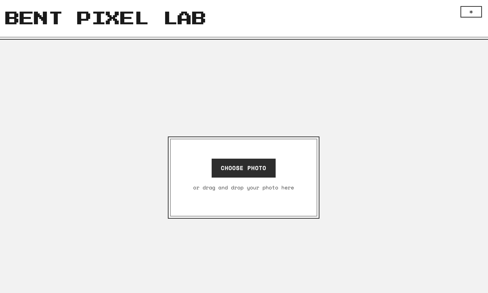

# Bent Pixel Lab

A web-based image glitch art creation tool that makes databending accessible and interactive. Create unique digital art effects through an interface with real-time previews.

Built with standard JavaScript and HTML5 Canvas. This project aims to make often experimental techniques accessible while honoring the artistic and technical heritage of glitch art.

Special thanks to the global glitch art community for openly sharing techniques, tools, and knowledge that made this project possible.



## Features

- **Classic Glitch Effects**
  - Bit Shift: Digital corruption artifacts through bit manipulation
  - Data Offset: File corruption simulation with data displacement
  - RGB Split: Chromatic aberration effects
  - Scanlines: CRT and VHS-style artifacts
  - Path Sort: Organic distortions following image contours
  - Seed Growth: Expanding distortion patterns from bright points
  - Pixel Sort: Brightness-based pixel organization

- **Grid-Based Effects**
  - Pixel Flow: Directional pixel displacement
  - Vortex Warp: Spiral distortion patterns
  - Crystal Shatter: Fragmented displacement effect
  - Ripple Wave: Wavelike distortion patterns
  - Neon Pulse: Brightness-based glow effects
  - Prism Split: Color channel separation effects

- **Audio Visualization**
  - Playback of image data to audio
  - Playback controls

- **Preset System**
  - Built-in effect presets
  - Save and manage custom presets
  - Share preset configurations

- **User Interface**
  - Dark/Light theme support
  - Intuitive slider controls
  - Real-time preview updates
  - Responsive design

## Getting Started

### Local Project Prerequisites
- Safari and Firefox Tested
- Support for HTML5 Canvas
- Support for Web Audio API

### Installation
1. Clone the repository:
   ```bash
   git clone <repository-url>
   cd photos
   ```

2. Open `index.html` in a web browser or serve using a local server:
   ```bash
   # Using Python 3
   python -m http.server 8000
   
   # Using Node.js
   npx serve
   ```

3. Access the application at `http://localhost:8000`

## Usage

1. **Upload an Image**
   - Click "Choose Photo" or drag and drop an image
   - Supported formats: PNG, JPEG, GIF

2. **Apply Effects**
   - Use sliders to adjust classic effects
   - Click grid cells to apply localized effects
   - Combine multiple effects for layered results

3. **Save Your Work**
   - Click "Save" to download the processed image
   - Save custom presets for later use (session only currently, sorry)

## Effect Descriptions

### Classic Effects

- **Bit Shift**: Shifts the bits of each color channel, creating digital corruption artifacts. This effect simulates data corruption by manipulating the binary data of the image.

- **Data Offset**: Displaces chunks of image data, creating a "broken" look. This effect simulates file corruption by moving blocks of pixel data.

- **RGB Split**: Separates the red, green, and blue color channels vertically. Creates a chromatic aberration look similar to old CRT displays.

- **Scanlines**: Adds horizontal scan lines and subtle distortion. Mimics the look of old CRT displays and VHS tapes.

- **Path Sort**: Sorts pixels along paths of least resistance in the image. Creates organic-looking distortions that follow natural contours.

- **Seed Growth**: Creates organic distortions that grow from bright points in the image. Identifies bright areas as "seeds" and grows distortion patterns outward.

- **Pixel Sort**: Sorts pixels based on brightness within segments. Creates long streaks by organizing pixels in vertical bands.

### Grid Effects

- **Pixel Flow**: Creates directional movement of pixels within the selected grid cell.
- **Vortex Warp**: Generates a spiral distortion effect centered on the grid cell.
- **Crystal Shatter**: Fragments and displaces the image in a crystalline pattern.
- **Ripple Wave**: Produces wave-like distortions radiating from the center.
- **Neon Pulse**: Enhances bright areas with a glowing effect.
- **Prism Split**: Separates and shifts color channels in various directions.


## License

This project is licensed under the MIT License - see the [LICENSE](LICENSE) file for details.

## Acknowledgments

### Historical Influences & Credits

This project stands on the shoulders of pioneers in glitch art and databending:

#### Pioneers
- **Nam June Paik** (1965) - Created "TV Magnet", one of the first deliberate manipulations of electronic media for artistic purposes
- **Jamie Fenton & Raul Zaritsky** (1978) - Created "Digital TV Dinner", a groundbreaking early example of intentional video manipulation
- **JODI** (Joan Heemskerk & Dirk Paesmans) - Pioneered net.art and early digital glitch aesthetics in the 1990s
- **Kim Cascone** (2000) - Coined "post-digital" aesthetics and explored glitch in computer music
- **Rosa Menkman** - Author of the "Glitch Studies Manifesto" and "The Glitch Moment(um)", fundamental texts in glitch art theory


#### Shoutouts
- Michael Betancourt's "Glitch Art in Theory and Practice"
- Rosa Menkman's research on glitch aesthetics
- GLI.TC/H community


## TODO

- GIF creation and exporting
- Audio exporting
- HEX Editor